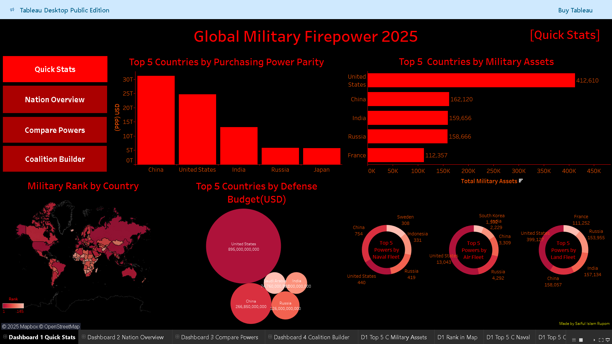
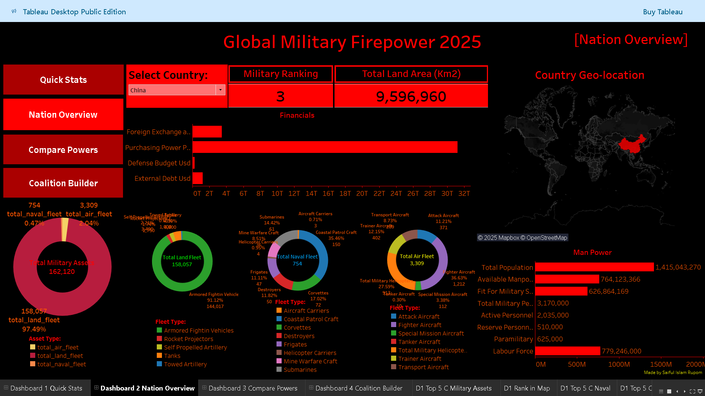
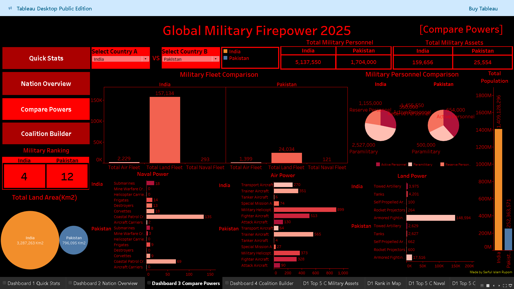
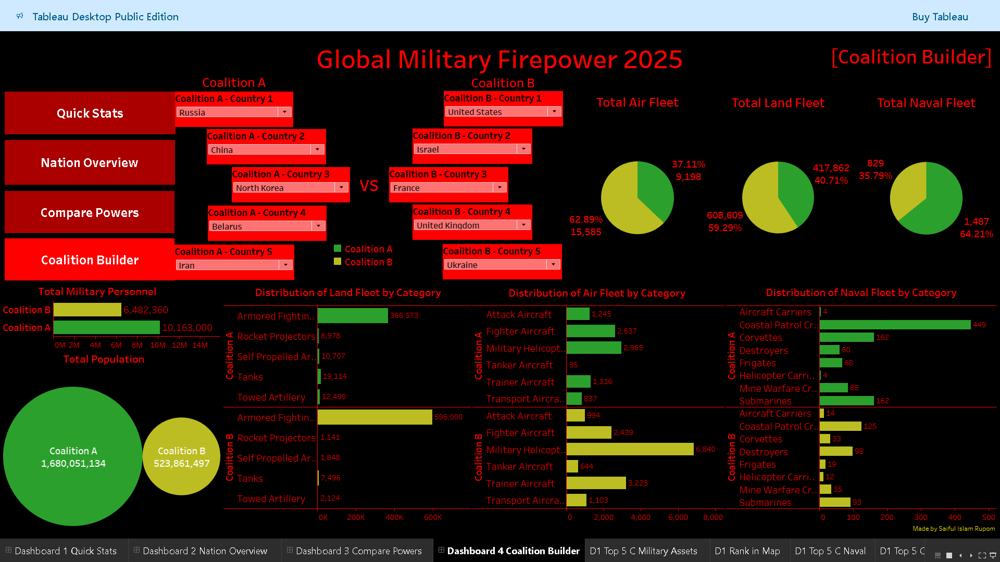

# Global Military Firepower 2025: An End-to-End Project from Web Scraping to Dashboard Building

## Project Overview
This project showcases an end-to-end data workflow, beginning with web scraping and ending in interactive dashboard development. Using Python, I scraped military power data from the Global Firepower website, cleaned and prepared it for analysis, and visualized it using Tableau Public. The final result is a comprehensive dashboard suite that provides deep insights into global military capabilities for the year 2025 like top powers, country military profiles, compare two nations side by side based on their military assets, build coalitions that are consist of multiple countries and compare those coalitions.

## Objective
The objective of this project is to demonstrate an end-to-end data science workflow by extracting real-world military power data from the Global Firepower website using web scraping techniques in Python, cleaning and preparing the data for analysis, and developing an interactive Tableau dashboard. The final product aims to provide policymakers, researchers, and the general public with actionable insights into global military capabilities through visual storytelling and comparative analytics.

## Data Source
- **Website:** [Global Firepower](https://www.globalfirepower.com/)
- **Types of data:** Military statistics of 140+ countries including manpower, land/naval/air assets, budgets, logistics, natural resources, geography and more.
- **Data Collection Method:** Web scraping using Python (`BeautifulSoup`, `requests`, `pandas`)

## Project Workflow
1. **Web Scraping**
   - Collected data from multiple pages (country profiles, overall ranking tables, military equipments, etc.)
   - Used `requests` and `BeautifulSoup` to extract structured data.
2. **Data Cleaning**
   - Cleaned missing or inconsistent values using python custom functions alongside web scraping but the one column 'region' was created manually by leveraging the power of AI because there were not enough data of 'region'(continent) for each of the countries in that website.
   - Standardized column names and data formats using pandas
   - Saved the final dataset as .csv and then manually converted into .xlsx for easy import into Tableau
3. **Data Visualization (Dashboarding using Tableau Public)**
   - Built an interactive Tableau workbook with 4 unique dashboards(Quick Stats, Nation Overview, Compare Powers & Coalition Builder)
   - Linked views for smooth interactivity and user experience

## Tableau Dashboards Overview
**View Dashboard on Tableau Public**: [Click here.](https://public.tableau.com/views/global_military_firepower_2025/Dashboard1QuickStats?:language=en-US&:sid=&:redirect=auth&:display_count=n&:origin=viz_share_link) (Note: Online view may show slight distortion or layout changes in visuals)
**The workbook contains the following dashboards:**
### 1. Quick Stats
- Showcases the top 5 countries in key military metrics such as defense budget, purchasing power parity, global rank, and military assets(naval/land/air).
- Allows quick comparison using color-coded bars, donut chart, circles, maps and sorted visuals.
### 2. Nations Overview
- Select any country to view its detailed stats including:
  - Military Ranking
  - Total Land Area
  - Country Geo-location
  - Defense Budget
  - Total Personnel
  - Land, Air, and Naval assets
  - Population and service availability
### 3. Compare Powers
- Perform side-by-side comparisons of two selected countries.
- Compare strengths in manpower, different types of military assets(air/land/naval), military personnel(active/reserve/paramilitary) and total land areas etc.
### 4. Coalition Builder
- Create two coalitions (up to 5 countries each).
- Analyze the combined power of each coalition.
- Helps understand the balance of power in potential military alliances.

## Dashboard Snapshots
Here are some previews of the Tableau dashboards created in this project:
### Quick Stats


### Nations Overview


### Compare Powers


### Coalition Builder


## Demo Video
[](https://www.youtube.com/watch?v=viOMhQeQaLk)

## Tools and Technologies

| Category           | Tools / Libraries                   |
|--------------------|-------------------------------------|
| Web Scraping       | Python, BeautifulSoup, requests     |
| Data Cleaning      | pandas, Custom functions            |
| Data               | .csv & .xlsx                        |
| Data Visualization | Tableau Public                      |
| File Format        | .twbx (Tableau Packaged Workbook)   |
| Version Control    | Git, GitHub                         |

## Features
- Complete automation of data collection through web scraping
- Reproducible code for scraping and cleaning
- Highly interactive dashboards for storytelling and analysis
- Real-world case study combining data engineering and analytics

## How to Use
1. Clone the repository:
   ```bash
   git clone https://github.com/saiful-islam-rupom/global-military-firepower-2025-web-scraping-to-dashboard-building.git 
2. Navigate to the web-scraping/ directory and open the Jupyter notebook to explore the scraping and cleaning logic.
3. Open the .twbx file using Tableau Public Desktop, or view it online through the provided Tableau Public link.

## Future Enhancements
- Automate daily/weekly updates for real-time dashboard refresh
- Add ranking trends over time using historical data
- Integrate additional geopolitical datasets for richer insights

## Disclaimer
This project is for educational purposes only. The scraped data complies with the site's terms of use at the time of access.

## License
This project is licensed under [CC BY-NC 4.0](LICENSE).

## Acknowledgements
Special thanks to [Global Firepower](https://www.globalfirepower.com/) for providing publicly accessible military data.
